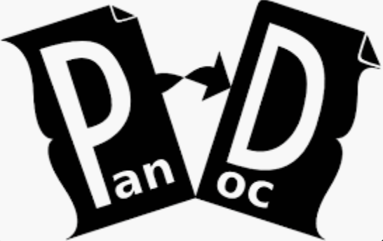

# Notes

Example document. This is a template for a markdown document.



## Section

Pandoc is a Haskell library for converting from one markup format to another, and a command-line tool that uses this library. It can read markdown and (subsets of) reStructuredText, HTML, and LaTeX, and it can write markdown, reStructuredText, HTML, LaTeX, ConTeXt, PDF, RTF, DocBook XML, OpenDocument XML, ODT, GNU Texinfo, MediaWiki markup


# Formatting

## Code

Supports code highlighting

```python
print("Hello World")
```

## Lists

* Foo
* Bar
* Baz
