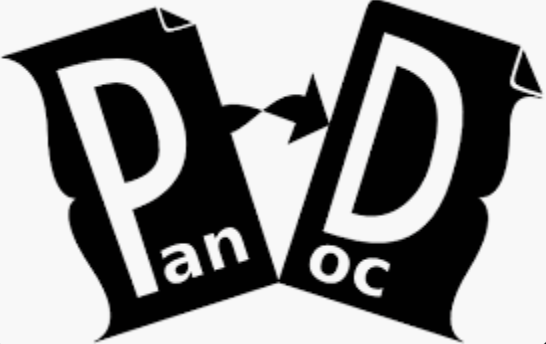

<!-- markdownlint-disable MD025 MD033 -->

# Notes

Example document. This is a template for a markdown document.


## Section

Pandoc is a Haskell library for converting from one markup format to another, and a command-line tool that uses this library. It can read markdown and (subsets of) reStructuredText, HTML, and LaTeX, and it can write markdown, reStructuredText, HTML, LaTeX, ConTeXt, PDF, RTF, DocBook XML, OpenDocument XML, ODT, GNU Texinfo, MediaWiki markup

# Formatting

All Markdown elements are supported, and the document can be styled using CSS or nested HTML elements.

## Including images

Images can be included in the document via ``, for example: ``.



## Code

Supports code highlighting.

```python
print("Hello World")
```

## Lists

* Foo
* Bar
* Baz

1. Foo
1. Bar
1. Baz
